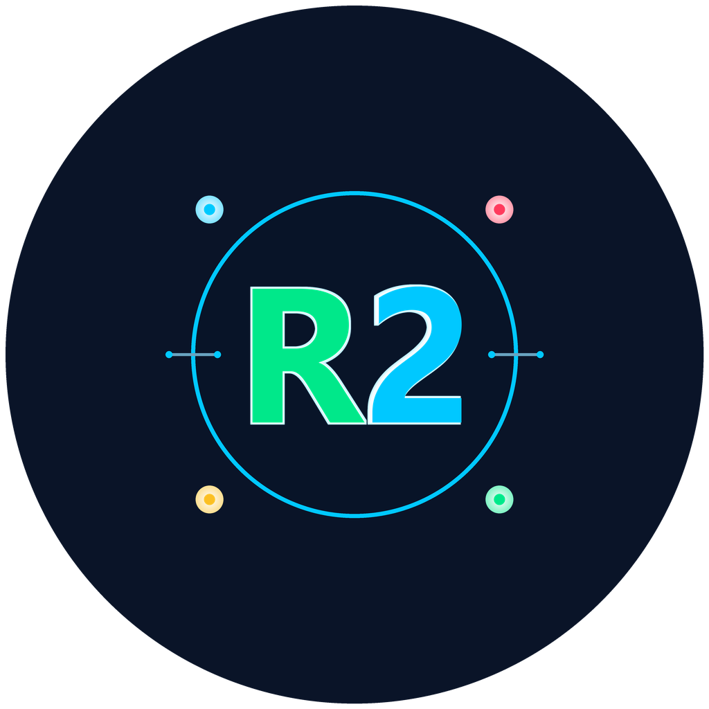

# 🤖 R2 Mission Control

Εφαρμογή ελέγχου για το εκπαιδευτικό ρομπότ **R2** της Polytech σε Android tablet & κινητό, μέσω Bluetooth.

  
   
  <b>R2 Mission Control</b>

---

## Οθόνες

### 🏠 Κεντρική Οθόνη

Η βασική οθόνη ελέγχου. Αριστερά τα χειριστήρια, δεξιά τα δεδομένα από το ρομπότ.

**Χειριστήρια:**

- 🕹️ **Joystick** — αναλογικός έλεγχος με αυτόματο υπολογισμό ταχύτητας αριστερού/δεξιού τροχού.
- 🎮 **Κατευθυντικό Pad (D-Pad)** — 8 κατευθύνσεις (↑ ↓ ← → και 4 διαγώνια) με κεντρικό κουμπί 📯 κόρνας. Οι πλευρικές/διαγώνιες κινήσεις χρησιμοποιούν σταθερή ταχύτητα για ακριβή ελιγμό.
- ⚡ **Slider ταχύτητας** — ρυθμίζει την ταχύτητα joystick και D-Pad. Ο δείκτης αλλάζει χρώμα: 🟢 αργά · 🟡 μεσαία · 🔴 γρήγορα.

 

**Τηλεμετρία (real-time):**

| | |
|--|--|
| 📡 Εμπόδιο | Απόσταση σε cm |
| 🚗 Κίνηση | Τρέχουσα κατάσταση |
| ⚡ Ταχύτητα | Αριστερός / Δεξιός τροχός |
| 〰️ Γραμμή | Αισθητήρες A1, A2, A3 |
| ☀️ Φως | Επίπεδο lux |
| 🔊 Ήχος | Ένταση (raw) |

 

**Κουμπιά πλοήγησης:**

⚙️ ΠΡΟΓΡΑΜΜΑΤΑ · ❓ ΚΟΥΙΖ · 🎹 ΠΙΑΝΟ · 🎮 ΤΙΜΟΝΙ · 🎤 ΦΩΝΗΤΙΚΟΣ ΕΛΕΓΧΟΣ · ℹ️ ΠΛΗΡΟΦΟΡΙΕΣ

Η σύνδεση με το ρομπότ γίνεται πατώντας το εικονίδιο Bluetooth 🔵 — μια λίστα δείχνει τις διαθέσιμες συσκευές. Η εφαρμογή ειδοποιεί αν χαθεί η σύνδεση.

> 💡 Αν έχεις πολλά R2 με το ίδιο εργοστασιακό όνομα Bluetooth, εύκολα μπερδεύονται στη λίστα συσκευών.
> Με το **[BT24 Manager](https://github.com/vmihas/BT24-Manager)** μπορείς να δώσεις σε κάθε module ένα ξεχωριστό, αναγνωρίσιμο όνομα.

---

### ⚙️ Προγράμματα

Επιλογή αυτόνομης συμπεριφοράς του ρομπότ και ρύθμιση αισθητήρων. Οι αλλαγές στέλνονται στο R2 με το κουμπί **ΑΠΟΣΤΟΛΗ ΠΡΟΓΡΑΜΜΑΤΟΣ**.

#### ⚡ ΛΕΙΤΟΥΡΓΙΕΣ — *(επιλογή μίας κάθε φορά)*

| | Λειτουργία | Περιγραφή |
|--|-----------|-----------|
| 🚗 | Κίνηση | Τηλεκατεύθυνση με ενεργούς αισθητήρες |
| 🛤️ | Ακολούθηση γραμμής | Ακολουθεί μαύρη γραμμή |
| 🤚 | Ακολούθηση χεριού | Ακολουθεί χέρι μπροστά του |
| 🛡️ | Αποφυγή πτώσης | Κινείται στο τραπέζι χωρίς να πέσει |
| 🌻 | Ηλιοτρόπιο | Κινείται προς τη φωτεινή πηγή |
| 🕺 | Χορός | Χορεύει στο ρυθμό της μουσικής *(ρυθμιζόμενη ευαισθησία μικροφώνου)* |

#### 📡 ΑΙΣΘΗΤΗΡΕΣ — *(ανεξάρτητοι, συνδυάζονται με λειτουργία)*

| | Αισθητήρας | Επιλογές |
|--|-----------|----------|
| 📡 | Εμπόδια | STOP · ΑΡΙΣΤΕΡΑ · ΔΕΞΙΑ |
| 〰️ | Γραμμή | STOP · ΑΝΑΣΤΡΟΦΗ · ΑΡΙΣΤΕΡΑ · ΔΕΞΙΑ |

#### 🔌 ΕΝΕΡΓΟΠΟΙΗΤΕΣ

| | Ενεργοποιητής | Επιλογές |
|--|--------------|----------|
| 🌈 | RGB LED | Χρώμα ανά κατεύθυνση *(ρυθμιζόμενο)* |
| 🔊 | Βομβητής | ΜΠΡΟΣΤΑ · ΠΙΣΩ · ΑΡΙΣΤΕΡΑ · ΔΕΞΙΑ |
| 💡 | LED λευκό | ΜΠΡΟΣΤΑ · ΠΙΣΩ · ΑΡΙΣΤΕΡΑ · ΔΕΞΙΑ |

#### 🎯 ΕΝΑΥΣΜΑΤΑ — *(επιλογή ενός — το πρόγραμμα ξεκινά μόνο όταν ενεργοποιηθεί)*

| | Εναύσμα | Περιγραφή |
|--|---------|-----------|
| 👆 | Κουμπί αφής | Ξεκινά με άγγιγμα |
| ☀️ | Αισθητήρας φωτός | Ξεκινά με επαρκή φωτισμό |
| 🎤 | Μικρόφωνο | Ξεκινά με παλαμάκια |

> 📘 Δείτε [εδώ](SCENARIOS.md) ενδεικτικά σενάρια προγραμμάτων, με ιδέες για χρήση στην τάξη.

---

### ❓ Κουίζ

Εκπαιδευτικό quiz game με πηγές ερωτήσεων από **Kahoot** ή **Wayground (Quizizz)** και feedback οπτικό/κίνηση στο ρομπότ.

**Πηγές ερωτήσεων:**

- 📷 **Σκανάρισμα QR Code** — σκανάρισμα Kahoot ή Wayground link με την κάμερα.

  

  
Πώς φτιάχνω QR code για το κουίζ μου;

  1. Άνοιξε το κουίζ σου στο **Kahoot** ή στο **Wayground (Quizizz)** και αντιγράψε το link του (από τη γραμμή διευθύνσεων του browser).
  2. Επικόλλησέ το σε οποιαδήποτε δωρεάν online υπηρεσία δημιουργίας QR code (π.χ. [qr-code-generator.com](https://www.qr-code-generator.com/)).
  3. Αποθήκευσε ή εκτύπωσε το QR code που θα δημιουργηθεί — οι μαθητές το σκανάρουν με την κάμερα του tablet και το κουίζ φορτώνει αυτόματα.

  **Παραδείγματα:**

  

  
📎 Παράδειγμα Kahoot QR code

  

  [create.kahoot.it/details/dec74f6f-7a1b-4ff6-a23f-1dff8aeb3b55](https://create.kahoot.it/details/dec74f6f-7a1b-4ff6-a23f-1dff8aeb3b55)

  

  

  
📎 Παράδειγμα Wayground QR code

  

  [wayground.com/admin/quiz/66f07abc9ce3dc4826523e9f](https://wayground.com/admin/quiz/66f07abc9ce3dc4826523e9f)

  

  

- 🔗 **Εισαγωγή URL / ID** — επικόλληση Kahoot UUID ή Wayground / Quizizz ID.
- 📝 **Ενσωματωμένο κουίζ** — έτοιμες ερωτήσεις για το R2.

**Δύο τρόποι παιχνιδιού:**

- 🖥️ **DESK Mode** — το ρομπότ μένει στη θέση του και κάνει νεύμα ✅ ΝΑΙ σε σωστή απάντηση ή ❌ ΟΧΙ σε λάθος.
- 🏁 **RACING Mode** — το ρομπότ κάνει ένα βήμα μπροστά σε κάθε σωστή απάντηση· σε λάθος μένει ακίνητο (κούρσα γνώσεων).

- 📊 Βαθμολογία, εξήγηση σωστής απάντησης, ήχος + RGB LED feedback, αποτελέσματα στο τέλος.

---

### 🎹 Πιάνο

Πληκτρολόγιο αφής 2,5 οκτάβων (C4–C6, 25 πλήκτρα).

- 15 λευκά + 10 μαύρα πλήκτρα, με **διαφορετικό χρώμα για κάθε νότα** ως οπτικό feedback (και στην οθόνη και στο RGB LED του ρομπότ).
- 🎶 **Ελεύθερο παίξιμο** — πάτα όποιο πλήκτρο θέλεις και ακούγεται η νότα, ενώ το ρομπότ φωτίζεται με το αντίστοιχο χρώμα.
- 🔊 **Διακόπτης ήχου** — επιλογή αν η νότα ακούγεται μόνο από το ρομπότ ή και από το tablet.

**🎵 Έτοιμες μελωδίες με rolling piano** (νότες που πέφτουν από ψηλά, όπως στα παιχνίδια ρυθμού):

π.χ. ⭐ Τι χαρά, τι χαρά · 🌙 Φεγγαράκι μου λαμπρό · 🐣 Ύμνος της χαράς κ.α.

**Δύο τρόποι παιχνιδιού:**

- 🎼 **MAESTRO Mode** — παίζεις τη μελωδία στο πληκτρολόγιο ακολουθώντας τις νότες που πέφτουν.
- 🏁 **RACING Mode** — σε κάθε σωστή νότα το ρομπότ κάνει ένα βήμα μπροστά.

- 📊 Στατιστικά στο τέλος: ακρίβεια, χρόνος, βήματα ρομπότ (RACING) και τελικό σκορ.

---

### 🎮 Τιμόνι

Το tablet γίνεται τιμόνι — έλεγχος γέρνοντας τη συσκευή.

- 🔄 Γυροσκόπιο αριστερά/δεξιά → στροφή.
- ⬆️ Κλίση εμπρός → κίνηση · ⬇️ Κλίση πίσω → όπισθεν.
- Κουμπί ΕΚΚΙΝΗΣΗ / ΔΙΑΚΟΠΗ.
- Αυτόματο STOP κατά την έξοδο από την οθόνη.

---

### 🎤 Φωνητικός Έλεγχος

Έλεγχος του ρομπότ με φωνητικές εντολές στα **Ελληνικά**.

| Κατηγορία | Εντολές |
|-----------|---------|
| Κίνηση | *"μπροστά", "πίσω", "αριστερά", "δεξιά"* |
| Ταχύτητα | *"αργά", "μεσαία", "γρήγορα"* |
| 📯 Κόρνα | *"κόρνα", "μπιπ"* |

- Ένα πάτημα = μία εντολή. Αυτόματο STOP μετά από κάθε κίνηση.
- Ιστορικό τελευταίων 6 εντολών.
- ⚠️ Απαιτεί σύνδεση WiFi (Google Cloud αναγνώριση ομιλίας).

---

### ℹ️ Πληροφορίες

Οθόνη με την έκδοση της εφαρμογής και πίνακα συνδεσμολογίας των αισθητήρων και εξόδων του R2 (θύρες Arduino):

---

## 📱 Τεχνικά

- Λειτουργεί σε Android κινητά και tablet, σε **οριζόντια προβολή** (landscape).
- Η διάταξη προσαρμόζεται στο μέγεθος της οθόνης. Αν κάποιο panel ή κουμπί δε χωράει, μπορείς να κάνεις κύλιση (scroll) πάνω-κάτω ή αριστερά-δεξιά για να το φτάσεις.
- Σκοτεινό διαστημικό θέμα.

> 📍 **Bluetooth σε παλιότερες συσκευές:** Σε Android 11 και παλαιότερο, το λειτουργικό σύστημα απαιτεί ενεργή **Τοποθεσία (GPS)** για να λειτουργήσει η σάρωση Bluetooth. Χωρίς αυτήν, η λίστα συσκευών εμφανίζεται κενή, ανεξάρτητα αν το Bluetooth είναι ενεργοποιημένο. Αν δεν βλέπεις καμία συσκευή στη σάρωση, ενεργοποίησε την Τοποθεσία από τις ρυθμίσεις της συσκευής.

**Άδειες που ζητά η εφαρμογή:**

| Άδεια | Λόγος χρήσης |
|-------|--------------|
| 🔵 Bluetooth (σάρωση / σύνδεση) | Εντοπισμός και σύνδεση με το R2 |
| 📍 Τοποθεσία | Απαιτείται από το Android ≤ 11 για σάρωση Bluetooth (βλ. παραπάνω). Η εφαρμογή δεν καταγράφει ή αποθηκεύει τοποθεσία |
| 📷 Κάμερα | Σκανάρισμα QR code στο Κουίζ |
| 🎤 Μικρόφωνο | Φωνητικός Έλεγχος (αναγνώριση ομιλίας) |
| 🌐 Internet | Φόρτωση ερωτήσεων Κουίζ (Kahoot / Wayground) & αναγνώριση ομιλίας |

---

## ⚡ Firmware (απαραίτητο για να λειτουργήσει το ρομπότ)

Για να επικοινωνήσει η εφαρμογή με το R2, το Arduino μέσα στο ρομπότ πρέπει να έχει το κατάλληλο **firmware** εγκατεστημένο.

Για την εγκατάσταση χρησιμοποιείται το **R2 Mission Flasher** — ξεχωριστή desktop εφαρμογή φτιαγμένη ειδικά για αυτό το σκοπό.

  
   
  <b>R2 Mission Flasher</b>

**Τι κάνει:**

- 🔌 Ανιχνεύει αυτόματα το R2 (Arduino) μόλις συνδεθεί με καλώδιο USB.
- 📤 Κάνει αυτόματο upload του firmware μόλις αναγνωριστεί η συσκευή — χωρίς να χρειάζεται καμία επιπλέον ενέργεια.
- 🤖🤖 Υποστηρίζει ταυτόχρονο flash σε **πολλά ρομπότ** αν συνδεθούν διαδοχικά (χρήσιμο σε σχολικό εργαστήριο με πολλά R2).
- 🗑️ Επιλογή για upload **κενού sketch**, αν θέλεις να «καθαρίσεις» εύκολα & γρήγορα ένα ή περισσότερα R2 (δουλεύει και σε S1).
- 🔢 Μετρητής επιτυχημένων uploads της συνεδρίας.

> Το firmware χρειάζεται να ξαναγίνει upload μόνο όταν βγαίνει νέα έκδοση, ή αν το ρομπότ επαναπρογραμματιστεί για άλλο σκοπό.

---

## 🔵 BT24 Manager (χρήσιμο εργαλείο)

Όταν υπάρχουν πολλά ρομπότ R2 στην ίδια τάξη, τα Bluetooth module τους έχουν το ίδιο εργοστασιακό
όνομα — κάτι που μπερδεύει τους μαθητές στη λίστα συσκευών της εφαρμογής.

Το **[BT24 Manager](https://github.com/vmihas/BT24-Manager)** είναι ένα ξεχωριστό εργαλείο που επιτρέπει
την εύκολη αλλαγή του ονόματος του BT module του R2, ώστε κάθε ρομπότ να αναγνωρίζεται μοναδικά κατά τη
σύνδεση.

---

## ✍️ Author

**Βαγγέλης Μίχας**  
Electrical and Computer Engineer, NTUA | M.Sc. | Primary School CS Educator  
📧 [vmihas@sch.gr](mailto:vmihas@sch.gr)

---

## ⚖️ License

Η εφαρμογή διατίθεται δωρεάν υπό την άδεια **[CC BY-NC-ND 4.0](https://creativecommons.org/licenses/by-nc-nd/4.0/)** (Attribution-NonCommercial-NoDerivatives).

Μπορεί να χρησιμοποιηθεί και να μοιραστεί ελεύθερα, με τους όρους:

- 📛 **Αναφορά (BY)** — να αναφέρεται ο δημιουργός.
- 🚫 **Μη εμπορική χρήση (NC)** — όχι πώληση ή εμπορική εκμετάλλευση.
- 🔒 **Χωρίς παράγωγα έργα (ND)** — δεν επιτρέπεται τροποποίηση ή αναδιανομή τροποποιημένης έκδοσης.

---

## ⭐ Support

Για προτάσεις, bugs και νέα χαρακτηριστικά:  
➡️ Άνοιξε issue στη σελίδα του GitHub repository, ή στείλε email στο [vmihas@sch.gr](mailto:vmihas@sch.gr)

---

## 📦 Latest Releases

Κατεβάστε την εφαρμογή από την ενότητα **Releases** του GitHub.
